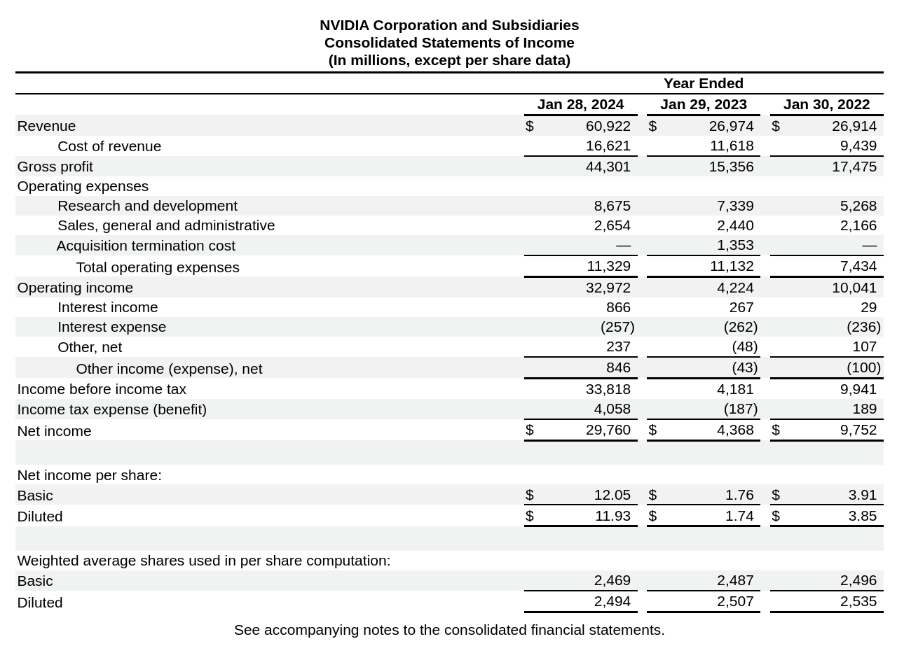

# Financial data extraction from SEC 10-K filings

## Overview

This proof-of-concept showcases how to automate the extraction of financial metrics from income statements in SEC 10-K filings using Outlines. Manually extracting data from financial reports is time-consuming and error-prone - analysts often spend hours copying numbers from PDFs or HTML files into spreadsheets.



Investors often want a simple CSV file to use in financial modeling and research. With Outlines, we can restrict the language model to extract the data we want _directly_ into a CSV file.

This tool automates the extraction process by:

1. Identifying relevant income statement sections within lengthy financial documents
2. Extracting key financial metrics into a standardized format
3. Validating the extracted data against known good values

The system is designed to be extensible - you can easily add new metrics to extract or switch to more powerful models.

## Quick Start

```bash
git clone https://github.com/dottxt-ai/demos
cd earnings-reports
pip install -r requirements.txt
python extraction.py
```

## Example Output

From Microsoft's 10k:

```csv
year,revenue,operating_income,net_income
2021,168088,69916,61271
2022,198270,83383,72738
2023,211915,88523,72361
```

## Prerequisites

- Python 3.8+
- Sufficient RAM
- (Optional) CUDA-capable GPU

Models can be run on CPU or GPU. Currently, the model is configured to use `transformers`. Please see a list of other inference backends supported by Outlines [here](https://dottxt-ai.github.io/outlines/latest/reference/models/models/).

## Features

- **Intelligent Document Processing**: Automatically identifies income statement sections within complex financial documents using natural language understanding
- **Structured Data Extraction**: Pulls out key financial metrics:
  - Annual revenue (top-line growth)
  - Operating income (operational efficiency)
  - Net income (bottom-line performance)
- **Data Quality Controls**: Built-in validation rules ensure extracted data makes logical sense (e.g., net income ≤ operating income ≤ revenue)
- **Standardized Output**: Generates clean CSV files ready for analysis
- **Validation Framework**: Compare extracted data against manual coding to ensure accuracy

## Real-World Applications

This demo can be adapted for various financial analysis tasks:
- Building company financial databases
- Automating regulatory compliance checks
- Creating automated financial research pipelines
- Supporting investment decision-making processes

## Technical Details

### Architecture

The system works in three main stages:

1. **Document Preprocessing**
   - Converts HTML to markdown for cleaner text
   - Breaks documents into pages for efficient processing
   - Removes irrelevant HTML formatting

2. **Income Statement Detection**
   - Uses a language model to classify pages as containing pieces of the income statement
   - Concatenates relevant pages for the extraction step

3. **Data Extraction**
   - Defines the columns to extract using regular expressions
   - Outputs standardized CSV format

### Project Structure


```
.
├── 10k/                 # Input HTML 10-K files
│   └── company1.html    # Example 10-K file
├── csv/                 # Extracted CSV output
│   └── company1.csv     # Generated output
├── manual/              # Manual extractions for validation
│   └── company1.csv     # Hand-coded reference data
├── extraction.py        # Main extraction script
└── validate-matches.py  # Validation script
```

After running `extraction.py`, you'll find the extracted CSV files in the `csv/` directory.

## Installation

1. Create a virtual environment (recommended):
   ```bash
   python -m venv venv
   source venv/bin/activate  # Unix
   # or
   .\venv\Scripts\activate  # Windows
   ```

2. Install dependencies:
   ```bash
   pip install -r requirements.txt
   ```

## Usage

### Basic Usage

1. Place your 10k HTML files in the `10k/` directory. You can download the HTML file from the [SEC's EDGAR database](https://www.sec.gov/cgi-bin/browse-edgar?company=&CIK=&type=10-K&owner=include&count=40&action=getcurrent).

2. Run the extraction:
   ```bash
   python extraction.py
   ```

The script processes each file sequentially and provides progress updates. For each file, it:
- Loads and preprocesses the HTML
- Identifies income statement sections
- Extracts financial metrics
- Saves a CSV to the `csv/` directory

### Validation Workflow

1. Create manual validation files:
   - Place hand-coded CSVs in `manual/`
   - Use the same filename as the extracted version
   - Follow the standard column format

2. Run validation:
   ```bash
   python validate-matches.py
   ```

3. Review the results:
   ```
   Results for company_name
   Extracted:
   year  revenue  operating_income  net_income
   2023  1000     200              150
   ...

   Manual:
   year  revenue  operating_income  net_income
   2023  1000     200              150
   ...

   All matches are valid!
   ```

## Configuration

### Language Model Selection

The demo uses Phi-3.5-mini-instruct by default:
```python
LANGUAGE_MODEL = "microsoft/Phi-3.5-mini-instruct"
```

You can switch to other models by changing the `LANGUAGE_MODEL` constant.

Consider:
- Larger models for better accuracy
- Smaller models for faster processing
- Specialized financial models if available

### Data Types

The extraction script supports several data types. Data types are defined by specific regular expressions.

- `year`: Four-digit year values, e.g. `2024`
- `integer_comma`: Large numbers with optional commas, e.g. `1,000,000`
- `number`: Decimal numbers with up to 2 decimal places, e.g. `1.23`

Add custom types by defining new regex patterns in `COLUMN_TYPE_REGEX` in the event that you want to have more control over column types generated by the model.


### Data Extraction Configuration

Customize the columns you wish to extract:

```python
COLUMNS_TO_EXTRACT = {
    "year": "year",                      # Fiscal year
    "revenue": "integer_comma",          # Total revenue
    "operating_income": "integer_comma", # Operating profit
    "net_income": "integer_comma"        # Final profit
}
```

To add a field like diluted earnings per share, you would change the `COLUMNS_TO_EXTRACT` dictionary to:

```python
COLUMNS_TO_EXTRACT = {
    "year": "year",                      # Fiscal year
    "revenue": "integer_comma",          # Total revenue
    "operating_income": "integer_comma", # Operating profit
    "net_income": "integer_comma",       # Final profit
    "diluted_eps": "number"              # Diluted earnings per share
}
```

returning

```
   year  revenue  operating_income  net_income  diluted_eps
0  2023   211915             88523       72361         9.68
1  2022   198270             83383       72738         9.65
2  2021   168088             69916       61271         8.05
```

__WARNING__: this system has not been tested rigorously with other financial metrics -- please do your own testing before expanding the list of metrics.

## Best Practices

1. Use the HTML files downloaded from the SEC's EDGAR database. Alternative document types have not been tested.
2. Create manual validation files for a sample of companies in the event that you want to validate the accuracy of the extracted data.
3. Consider more powerful models for difficult cases. The default model is `microsoft/Phi-3.5-mini-instruct`, which is a good balance between accuracy and speed. Smaller models can sometimes be confused by which numbers are relevant to the income statement.

## Limitations and Considerations

- The extraction step uses basic rules; complex accounting treatments may need manual review.
- The code is _only_ designed for annual income statements, you may need prompt adjustments to account for other financial statements.
- Unusual report formats or non-standard presentations may cause issues.

## Future Improvements

Potential enhancements to consider:
1. Support for additional financial statements (balance sheet, cash flows)
2. Extraction of more detailed metrics (segment data, footnotes)
3. Integration with financial databases
4. Advanced validation rules and anomaly detection
5. Support for different file formats (PDF, XBRL)
6. Extraction of qualitative information like riskiness, competition, etc.

## Troubleshooting

### Common Issues

Most issues you experience will be related to inference with the model. You may need to run smaller, quantized models.

A standard option is to use an AWQ model, by setting the `LANGUAGE_MODEL` constant in `extraction.py` to something like:

```python
LANGUAGE_MODEL = "TheBloke/Mistral-7B-Instruct-v0.1-AWQ"
```

If you have sufficient GPU memory, `vLLM` tends to be more performant and memory-efficient than `transformers`, so you may wish to use that instead:

```python
MODEL = outlines.models.vllm(
    LANGUAGE_MODEL
)
```

## Contributing

Contributions are welcome!
